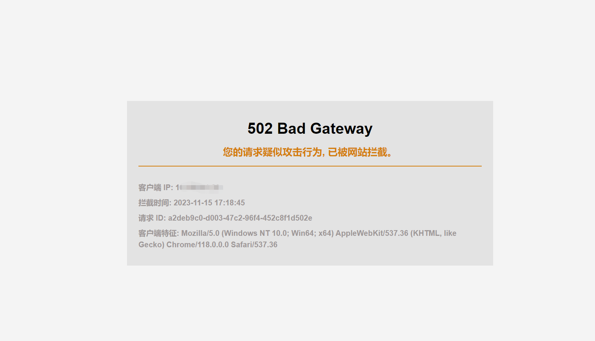
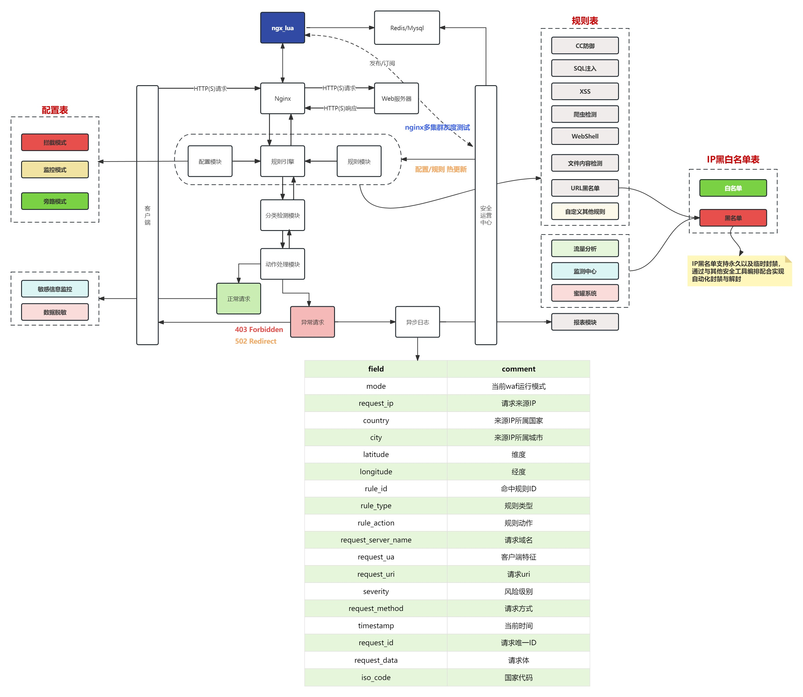

# wArmor - An WAF Framework based on OpenResty

## wArmor

### 性能并发

原生 `Nginx` 是基于事件驱动架构、异步非阻塞设计和轻量级进程的核心特性，实现了高性能和高并发的Web服务。
`wArmor` 充分利用了 `Openresty` 官方提供的异步非阻塞模块，如 `resty.http` 、`resty.redis` 、`resty.mysql`
和 `resty.logger.socket` 等，确保实现功能的同时也保证 `Nginx` 的高并发稳定性。

### 规则热更新

将 `WAF` 规则单独抽出为一个 `API` 服务，可在平台上针对规则、配置进行变更并实时通知 `WAF` 而无需重启 `Nginx` 。

### 编排联动

引入了灵活的 `IP黑白名单` 机制，可配合其他安全工具进行联动，`WAF`
的主要任务是拦截恶意请求并记录相关日志，而其他工具负责检测和更新 `IP黑名单` 。这样的分工协同确保了高效的安全响应。
另外 `IP黑白名单` 支持永久、临时封禁也同样可在平台上进行手动更新。

### 灰度测试(TODO)

考虑到 `Nginx` 多集群部署的情况，后续也会提供选择性关闭热更新的选项，以便在特定 `Nginx`
集群上进行规则更新。这使得灰度测试变得更加容易，确保规则的更新不会影响整个环境的正常运行，
一旦在特定集群上确认规则的正常工作，随后即可批量下发规则到其余集群。

### 规则引擎API文档(TODO)

针对 `IP黑白名单` 、 `规则`、 `配置`  进行增删改查以及列出表结构中定义的各项枚举值

## 规则引擎部署

### `mysql` 数据库

- 创建 `waf` 数据库

```mysql
    CREATE DATABASE waf CHARACTER SET utf8mb4 COLLATE utf8mb4_unicode_ci;
```

- 新建 `config` 配置表

```mysql
    CREATE TABLE IF NOT EXISTS config
    (
        id         INT AUTO_INCREMENT PRIMARY KEY COMMENT '配置模式主键ID',
        operator   VARCHAR(10) NOT NULL COMMENT '操作人',
        mode       INT         NOT NULL COMMENT '配置模式',
        created_at TIMESTAMP DEFAULT CURRENT_TIMESTAMP COMMENT '创建时间',
        updated_at TIMESTAMP DEFAULT CURRENT_TIMESTAMP ON UPDATE CURRENT_TIMESTAMP COMMENT '更新时间'
    )
```

- 新建 `ip` 黑白名单表

```mysql
    CREATE TABLE IF NOT EXISTS ip
    (
        id          INT AUTO_INCREMENT PRIMARY KEY COMMENT '黑白名单主键ID',
        operator    VARCHAR(10)  NOT NULL COMMENT '操作人',
        comment     VARCHAR(255) NOT NULL COMMENT '备注信息',
        ip_type     INT          NOT NULL COMMENT '黑白名单类型',
        block_type  INT       DEFAULT 1 COMMENT '封禁类型',
        ip_address  VARCHAR(15)  NOT NULL COMMENT '黑白名单IP',
        expire_time TIMESTAMP DEFAULT CURRENT_TIMESTAMP COMMENT '黑名单封禁时间',
        created_at  TIMESTAMP DEFAULT CURRENT_TIMESTAMP COMMENT '创建时间',
        updated_at  TIMESTAMP DEFAULT CURRENT_TIMESTAMP ON UPDATE CURRENT_TIMESTAMP COMMENT '更新时间'
    )
```

- 新建 `rule` 规则表

```mysql
#主表
CREATE TABLE IF NOT EXISTS rule
(
    id              INT AUTO_INCREMENT PRIMARY KEY COMMENT '规则主键ID',
    operator        VARCHAR(10)  NOT NULL COMMENT '操作人',
    rule_variable   INT          NOT NULL COMMENT '规则变量',
    rule_type       INT          NOT NULL COMMENT '规则类型',
    status          BOOLEAN      NOT NULL COMMENT '规则开启状态',
    rule_action     INT          NOT NULL COMMENT '规则执行动作',
    description     VARCHAR(255) NOT NULL COMMENT '规则描述',
    severity        INT          NOT NULL COMMENT '风险级别',
    rules_operation VARCHAR(3)   NOT NULL COMMENT '规则匹配条件(and/or)',
    created_at      TIMESTAMP DEFAULT CURRENT_TIMESTAMP COMMENT '创建时间',
    updated_at      TIMESTAMP DEFAULT CURRENT_TIMESTAMP ON UPDATE CURRENT_TIMESTAMP COMMENT '更新时间'
)
```

```mysql
#关联表
CREATE TABLE rules
(
    id         INT AUTO_INCREMENT PRIMARY KEY COMMENT '规则匹配详情主键ID',
    rule_id    INT          NOT NULL COMMENT '规则表外键',
    rules      VARCHAR(255) NOT NULL COMMENT '规则详情',
    FOREIGN KEY (rule_id) REFERENCES rule (id) ON DELETE CASCADE,
    created_at TIMESTAMP DEFAULT CURRENT_TIMESTAMP COMMENT '创建时间',
    updated_at TIMESTAMP DEFAULT CURRENT_TIMESTAMP ON UPDATE CURRENT_TIMESTAMP COMMENT '更新时间'
)
```

### 启动 `rule_engine`

`config core.config.toml` 作为规则引擎配置文件，需自行配置`mysql`、`redis` 相关信息

```bash
# start rule_engine
./bin/rule_engine -config core.config.toml
```

```bash
# check ping
curl http://rule_engine_ip:9999/ping
# pong
```

### 设定 `waf` 配置模式

```bash
curl -X POST -H "Content-Type: application/json" -d ' {
                "operator":"wArmor",
                "mode": 1
            }' http://rule_engine_ip:9999/api/v1/config
```

### 创建 `路径遍历` 规则

```bash
 curl -X POST -H "Content-Type: application/json" -d ' {
                "rule_variable": 1,
                "operator": "wArmor",
                "rule_type": 4,
                "status": true,
                "rules": [
                    "(?:etc/\\W*passwd)",
                    "(?:/|\\|\\\\)?(?:\\.\\./)+"
                ],
                "rule_action": 2,
                "description": "当检测到路径遍历攻击时waf将重定向拦截此行为",
                "rules_operation": "or",
                "severity": 3
            }' http://rule_engine_ip:9999/api/v1/rule
```

## WAF部署

### 安装 `libmaxminddb` 库

```bash
wget -P /usr/local/src https://github.com/maxmind/libmaxminddb/releases/download/1.7.1/libmaxminddb-1.7.1.tar.gz
tar -zxvf libmaxminddb-1.7.1.tar.gz
cd libmaxminddb-1.7.1
./configure
make && make install
echo /usr/local/lib >> /etc/ld.so.conf.d/local.conf
ldconfig
```

将 `GeoLite2-City.mmdb` 拷贝至 `/usr/local/share/GeoIP` 目录下。

### 安装 `Openresty`

```bash
cd /usr/local/src
wget https://openresty.org/download/openresty-1.21.4.2.tar.gz
tar zxf openresty-1.21.4.2.tar.gz
cd openresty-1.21.4.2
./configure --prefix=/usr/local/openresty \
--with-http_ssl_module \
--with-http_v2_module \
--with-http_realip_module \
--with-http_sub_module \
--with-http_stub_status_module \
--with-http_auth_request_module \
--with-http_secure_link_module \
--with-stream \
--with-stream_ssl_module \
--with-stream_realip_module \
--without-http_fastcgi_module \
--without-mail_pop3_module \
--without-mail_imap_module \
--without-mail_smtp_module

make && make install
```

`config.lua` 作为 `waf` 的配置文件，需自行配置`mysql`、`redis`、`syslog` 等信息，
并将 `waf` 文件夹拷贝至 `/usr/local/openresty` 目录下。

编辑 `nginx` 配置文件 `/usr/local/openresty/nginx/conf/nginx.conf` ，在 `http` 模块下新增

```bash
lua_shared_dict waf_rule 20m;
lua_shared_dict waf_config 1m;
lua_shared_dict waf_ip 20m;

lua_package_path "/usr/local/openresty/waf/?.lua;/usr/local/openresty/waf/lib/?.lua;;";
init_worker_by_lua_file /usr/local/openresty/waf/worker.lua;
access_by_lua_file /usr/local/openresty/waf/waf.lua;
body_filter_by_lua_file /usr/local/openresty/waf/body_filter.lua;
header_filter_by_lua_file /usr/local/openresty/waf/header_filter.lua;
```

重启 `nginx` 服务

```bash
/usr/local/openresty/nginx/sbin/nginx -s reload
```

如果部署一切正常，访问 `http://nginx_ip/api/v1/rule?query=../../etc/passwd` 浏览器会出现拦截信息。



拦截日志会异步写入远程 `syslog-ng` 服务器。

```json
{
  "program": "wArmor",
  "rule_action": "重定向",
  "city": "杭州",
  "country": "中国",
  "latitude": "30.2994",
  "longitude": "120.1612",
  "iso_code": "CN",
  "request_server_name": "*******",
  "request_uri": "/api/v1/rule?query=../../etc/passwd",
  "request_ua": "Mozilla/5.0 (Windows NT 10.0; Win64; x64) AppleWebKit/537.36 (KHTML, like Gecko) Chrome/118.0.0.0 Safari/537.36",
  "timestamp": "2023-11-15 17:18:45",
  "request_id": "a2deb9c0-d003-47c2-96f4-452c8f1d502e",
  "request_ip": "********",
  "severity": "中危",
  "rule_id": 1,
  "request_data": "",
  "mode": "拦截模式",
  "request_method": "GET",
  "rule_type": "路径遍历"
}
```

## 架构设计



## 文末

感谢 [bukaleyang/zhongkui-waf](https://github.com/bukaleyang/zhongkui-waf) 项目, `wArmor` 在其基础上进行了二次开发，并进行了性能和架构上的优化。

- `WAF` 与规则解耦实现热更新,现在每次规则变动都无需重启线上的 `Nginx` 服务，规则的热更新提升了灵活性和维护效率。

- 规则引入变量提高检查速度,`WAF` 知道要检查 `HTTP` 的哪个部分标识，而不必每次请求都遍历所有规则,提升了规则检查的速度。

- 日志性能优化,使用非阻塞的 `resty.logger.socket` 实现日志的异步写入，在高并发情况下保证了稳定性，避免了阻塞对业务的影响。另外日志中增加了请求的唯一ID，
  这在处理问题时非常有用，根据ID可以快速在海量日志中检索到对应的请求日志。
