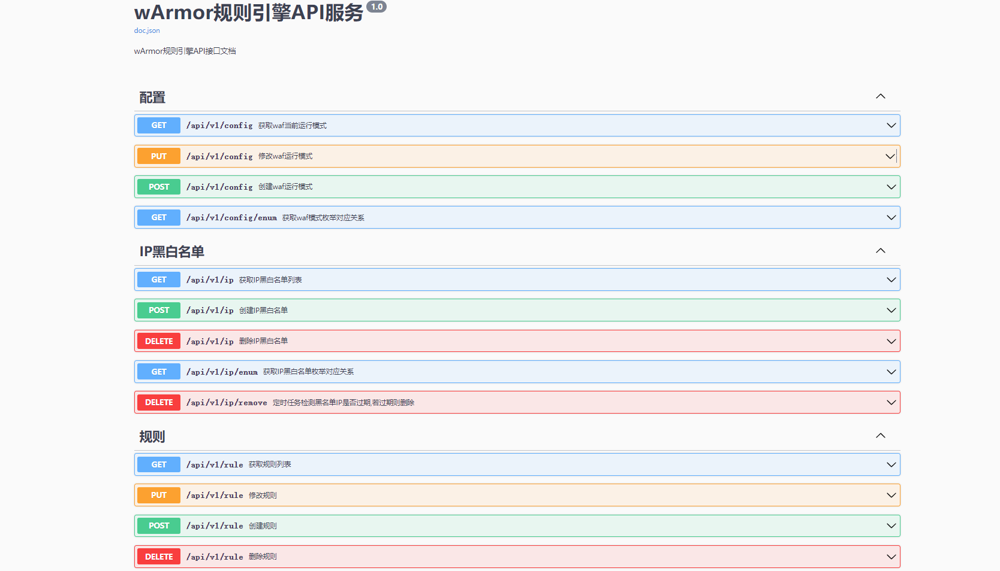
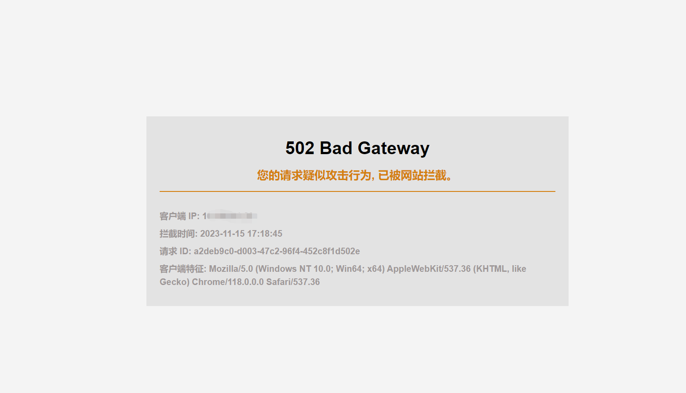
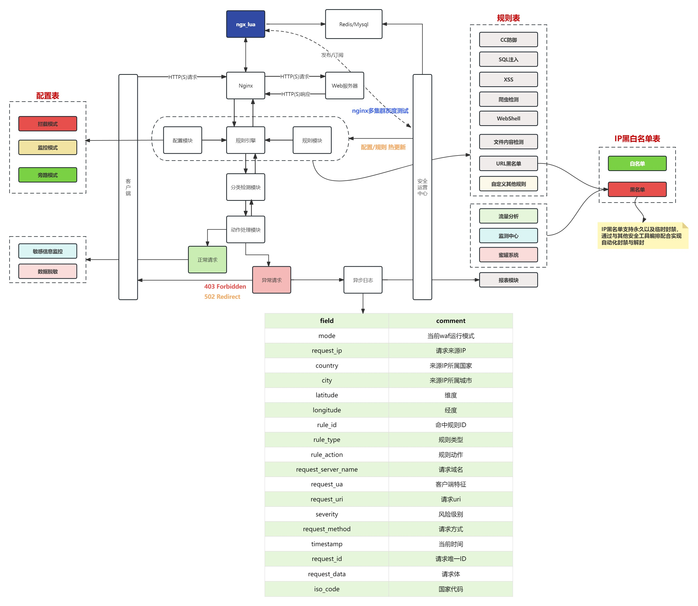

# wArmor - An WAF Framework based on OpenResty

[](https://www.murphysec.com/console/report/1725060297802076160/1725063962646499328)

### 性能并发 【Performance concurrency】

原生 `Nginx` 是基于事件驱动架构、异步非阻塞设计和轻量级进程的核心特性，实现了高性能和高并发的Web服务。
`wArmor` 充分利用了 `Openresty` 官方提供的异步非阻塞模块，如 `resty.http` 、`resty.redis` 、`resty.mysql`
和 `resty.logger.socket` 等，确保实现功能的同时也保证 `Nginx` 的高并发稳定性。

The native Nginx leverages an event-driven architecture, asynchronous non-blocking design, and lightweight processes as
core features, enabling high-performance and high-concurrency web services. wArmor maximizes the use of Openresty's
officially provided asynchronous non-blocking modules such as resty.http, resty.redis, resty.mysql, and
resty.logger.socket, ensuring both functionality and the high-concurrency stability of Nginx.

### 规则热更新 【Rule hot-reloading】

将 `WAF` 规则单独抽出为一个 `API` 服务，可在平台上针对规则、配置进行变更并实时通知 `WAF` 而无需重启 `Nginx` 。

Extracting the WAF rules into a separate API service allows for real-time modifications of rules and configurations on
the platform, providing instant notifications to the WAF without the need to restart Nginx.

### 编排联动 【Orchestrating linkages】

引入了灵活的 `IP黑白名单` 机制，可配合其他安全工具进行联动，`WAF`
的主要任务是拦截恶意请求并记录相关日志，而其他工具负责检测和更新 `IP黑名单` 。这样的分工协同确保了高效的安全响应。
另外 `IP黑白名单` 支持永久、临时封禁也同样可在平台上进行手动更新。

An adaptable IP blacklisting and whitelisting mechanism has been introduced, capable of collaborating with other
security tools. The primary role of the WAF is to intercept malicious requests and log relevant activities, while other
tools handle the detection and updating of the IP blacklist. This division of tasks ensures an efficient security
response. Additionally, the IP blacklisting and whitelisting feature supports permanent and temporary bans, allowing
manual updates via the platform.

### 灰度验证(TODO) 【Gray verification】

考虑到 `Nginx` 多集群部署的情况，后续也会提供选择性关闭热更新的选项，以便在特定 `Nginx`
集群上进行规则更新。这使得灰度测试变得更加容易，确保规则的更新不会影响整个环境的正常运行，
一旦在特定集群上确认规则的正常工作，随后即可批量下发规则到其余集群。

Considering the scenario of multiple-cluster deployment for Nginx, we'll be introducing an option to selectively disable
hot-reloading. This allows for rule updates on specific Nginx clusters, making gray testing more straightforward. It
ensures that rule updates do not affect the normal operation of the entire environment. Once the rules are confirmed to
be functioning properly on a specific cluster, they can be uniformly deployed across the remaining clusters.

### 规则引擎API文档 【rule engine API documentation】

访问 `http://rule_engine_ip:9999//swagger/index.html#/` API文档，针对 `规则` 、 `配置` 、 `IP黑白名单`
增删改查，某些枚举值含义参考枚举对应关系。

Access the API documentation at http://rule_engine_ip:9999//swagger/index.html#/. Perform CRUD operations for Rules,
Configurations, and IP Black/Whitelists. For certain enumerated values, refer to the corresponding relationship mapping.



## 规则引擎部署 【Rule Engine Deployment】

### `mysql` 数据库 【mysql database】

- 创建 `waf` 数据库 【CREATE DATABASE waf】

```mysql
    CREATE DATABASE waf CHARACTER SET utf8mb4 COLLATE utf8mb4_unicode_ci;
```

- 新建 `config` 配置表 【CREATE TABLE config】

```mysql
    CREATE TABLE IF NOT EXISTS config
    (
        id         INT AUTO_INCREMENT PRIMARY KEY COMMENT '配置模式主键ID',
        operator   VARCHAR(10) NOT NULL COMMENT '操作人',
        mode       INT         NOT NULL COMMENT '配置模式',
        created_at TIMESTAMP DEFAULT CURRENT_TIMESTAMP COMMENT '创建时间',
        updated_at TIMESTAMP DEFAULT CURRENT_TIMESTAMP ON UPDATE CURRENT_TIMESTAMP COMMENT '更新时间'
    )
```

- 新建 `ip` 黑白名单表 【CREATE TABLE ip】

```mysql
    CREATE TABLE IF NOT EXISTS ip
    (
        id          INT AUTO_INCREMENT PRIMARY KEY COMMENT '黑白名单主键ID',
        operator    VARCHAR(10)  NOT NULL COMMENT '操作人',
        comment     VARCHAR(255) NOT NULL COMMENT '备注信息',
        ip_type     INT          NOT NULL COMMENT '黑白名单类型',
        block_type  INT       DEFAULT 1 COMMENT '封禁类型',
        ip_address  VARCHAR(15)  NOT NULL COMMENT '黑白名单IP',
        expire_time TIMESTAMP DEFAULT CURRENT_TIMESTAMP COMMENT '黑名单封禁时间',
        created_at  TIMESTAMP DEFAULT CURRENT_TIMESTAMP COMMENT '创建时间',
        updated_at  TIMESTAMP DEFAULT CURRENT_TIMESTAMP ON UPDATE CURRENT_TIMESTAMP COMMENT '更新时间'
    )
```

- 新建 `rule` 规则表 【CREATE TABLE rule】

```mysql
#主表
CREATE TABLE IF NOT EXISTS rule
(
    id              INT AUTO_INCREMENT PRIMARY KEY COMMENT '规则主键ID',
    operator        VARCHAR(10)  NOT NULL COMMENT '操作人',
    rule_variable   INT          NOT NULL COMMENT '规则变量',
    rule_type       INT          NOT NULL COMMENT '规则类型',
    status          BOOLEAN      NOT NULL COMMENT '规则开启状态',
    rule_action     INT          NOT NULL COMMENT '规则执行动作',
    description     VARCHAR(255) NOT NULL COMMENT '规则描述',
    severity        INT          NOT NULL COMMENT '风险级别',
    rules_operation VARCHAR(3)   NOT NULL COMMENT '规则匹配条件(and/or)',
    created_at      TIMESTAMP DEFAULT CURRENT_TIMESTAMP COMMENT '创建时间',
    updated_at      TIMESTAMP DEFAULT CURRENT_TIMESTAMP ON UPDATE CURRENT_TIMESTAMP COMMENT '更新时间'
)
```

```mysql
#关联表
CREATE TABLE rules
(
    id         INT AUTO_INCREMENT PRIMARY KEY COMMENT '规则匹配详情主键ID',
    rule_id    INT          NOT NULL COMMENT '规则表外键',
    rules      VARCHAR(255) NOT NULL COMMENT '规则详情',
    FOREIGN KEY (rule_id) REFERENCES rule (id) ON DELETE CASCADE,
    created_at TIMESTAMP DEFAULT CURRENT_TIMESTAMP COMMENT '创建时间',
    updated_at TIMESTAMP DEFAULT CURRENT_TIMESTAMP ON UPDATE CURRENT_TIMESTAMP COMMENT '更新时间'
)
```

### 启动 `rule_engine` 【start rule_engine】

`config core.config.toml` 作为规则引擎配置文件，需自行配置`mysql`、`redis` 相关信息

Configure the core.config.toml file as the rule engine configuration file, where you need to set up the mysql and redis
related information manually.

```bash
# start rule_engine
./bin/rule_engine -config core.config.toml
```

```bash
# check ping
curl http://rule_engine_ip:9999/ping
# pong
```

### 设定 `waf` 配置模式 【Set up the WAF configuration mode】

```bash
curl -X POST -H "Content-Type: application/json" -d ' {
                "operator":"wArmor",
                "mode": 1
            }' http://rule_engine_ip:9999/api/v1/config
```

### 创建 `路径遍历` 规则 【Create a Path Traversal rule】

```bash
 curl -X POST -H "Content-Type: application/json" -d ' {
                "rule_variable": 1,
                "operator": "wArmor",
                "rule_type": 4,
                "status": true,
                "rules": [
                    "(?:etc/\\W*passwd)",
                    "(?:/|\\|\\\\)?(?:\\.\\./)+"
                ],
                "rule_action": 2,
                "description": "当检测到路径遍历攻击时waf将重定向拦截此行为",
                "rules_operation": "or",
                "severity": 3
            }' http://rule_engine_ip:9999/api/v1/rule
```

### 创建 `敏感信息监控` 规则 【Create a Sensitive information monitoring rule】

```bash
 curl -X POST -H "Content-Type: application/json" -d ' {
                "rule_variable": 6,
                "operator": "wArmor",
                "rule_type": 9,
                "status": true,
                "rules": ["You have an error in your SQL syntax"],
                "rule_action": 3,
                "description": "检测响应体是否包含原始sql错误信息而泄露表结构信息,开发者应处理该错误返回",
                "rules_operation": "or",
                "severity": 2
            }' http://rule_engine_ip:9999/api/v1/rule
``````

## WAF部署 【WAF deployment】

### 安装 `libmaxminddb` 库 【install libmaxminddb】

```bash
wget -P /usr/local/src https://github.com/maxmind/libmaxminddb/releases/download/1.7.1/libmaxminddb-1.7.1.tar.gz
tar -zxvf libmaxminddb-1.7.1.tar.gz
cd libmaxminddb-1.7.1
./configure
make && make install
echo /usr/local/lib >> /etc/ld.so.conf.d/local.conf
ldconfig
```

将 `GeoLite2-City.mmdb` 拷贝至 `/usr/local/share/GeoIP` 目录下。

Copy GeoLite2-City.mmdb to the /usr/local/share/GeoIP directory

### 安装 `Openresty` 【install Openresty】

```bash
cd /usr/local/src
wget https://openresty.org/download/openresty-1.21.4.2.tar.gz
tar zxf openresty-1.21.4.2.tar.gz
cd openresty-1.21.4.2
./configure --prefix=/usr/local/openresty \
--with-http_ssl_module \
--with-http_v2_module \
--with-http_realip_module \
--with-http_sub_module \
--with-http_stub_status_module \
--with-http_auth_request_module \
--with-http_secure_link_module \
--with-stream \
--with-stream_ssl_module \
--with-stream_realip_module \
--without-http_fastcgi_module \
--without-mail_pop3_module \
--without-mail_imap_module \
--without-mail_smtp_module

make && make install
```

`config.lua` 作为 `waf` 的配置文件，需自行配置`mysql`、`redis`、`syslog` 等信息，
并将 `waf` 文件夹拷贝至 `/usr/local/openresty` 目录下。

Edit the config.lua file as the configuration file for waf, requiring manual configuration of mysql, redis, syslog, and
other related information. Copy the waf folder to the /usr/local/openresty directory

编辑 `nginx` 配置文件 `/usr/local/openresty/nginx/conf/nginx.conf` ，在 `http` 模块下新增

Edit the nginx configuration file located at /usr/local/openresty/nginx/conf/nginx.conf. Add the following within the
http module

```bash
lua_shared_dict waf_rule 20m;
lua_shared_dict waf_config 1m;
lua_shared_dict waf_ip 20m;

lua_package_path "/usr/local/openresty/waf/?.lua;/usr/local/openresty/waf/lib/?.lua;;";
init_worker_by_lua_file /usr/local/openresty/waf/worker.lua;
access_by_lua_file /usr/local/openresty/waf/waf.lua;
body_filter_by_lua_file /usr/local/openresty/waf/body_filter.lua;
header_filter_by_lua_file /usr/local/openresty/waf/header_filter.lua;
```

重启 `nginx` 服务

restart nginx

```bash
/usr/local/openresty/nginx/sbin/nginx -s reload
```

如果部署一切正常，访问 `http://nginx_ip/api/v1/rule?query=../../etc/passwd` 浏览器会出现拦截信息。

If the deployment is successful, accessing http://nginx_ip/api/v1/rule?query=../../etc/passwd will result in
interception messages in the browser



拦截日志会异步写入远程 `syslog-ng` 服务器。

The interception logs will be asynchronously written to a remote syslog-ng server

- `路径遍历` 被拦截日志 【Logs for Path Traversal interceptions】

```json
{
  "program": "wArmor",
  "rule_action": "重定向",
  "city": "杭州",
  "country": "中国",
  "latitude": "30.2994",
  "longitude": "120.1612",
  "iso_code": "CN",
  "request_server_name": "*******",
  "request_uri": "/api/v1/rule?query=../../etc/passwd",
  "request_ua": "Mozilla/5.0 (Windows NT 10.0; Win64; x64) AppleWebKit/537.36 (KHTML, like Gecko) Chrome/118.0.0.0 Safari/537.36",
  "timestamp": "2023-11-15 17:18:45",
  "request_id": "a2deb9c0-d003-47c2-96f4-452c8f1d502e",
  "request_ip": "********",
  "severity": "中危",
  "rule_id": 1,
  "request_data": "",
  "mode": "拦截模式",
  "request_method": "GET",
  "rule_type": "路径遍历"
}
```

- `敏感信息监控` 日志 【Logs for Sensitive Information Monitoring】

```json
{
  "rule_type": "敏感信息",
  "rule_id": 2,
  "response": "{\"code\":400,\"msg\":\"Error 1064 (42000): You have an error in your SQL syntax; check the manual that corresponds to your MySQL server version for the right syntax to use near 'rules VARCHAR(255) NOT NULL COMMENT '规则详情',    \\n        \\t   FOREIGN KEY (rule_id) RE' at line 4\",\"data\":null}",
  "request_server_name": "*****",
  "request_uri": "/api/v1/user/list",
  "severity": "高危",
  "timestamp": "2023-11-17 14:41:12",
  "program": "wArmor",
  "request_method": "GET"
}
```

## 架构设计 【Architectural design】



## 文末 【End】

感谢 [bukaleyang/zhongkui-waf](https://github.com/bukaleyang/zhongkui-waf) 项目, `wArmor` 在其基础上进行了二次开发，并进行了性能和架构上的优化。

- `WAF` 与规则解耦实现热更新,现在每次规则变动都无需重启线上的 `Nginx` 服务，规则的热更新提升了灵活性和维护效率。

- 规则引入变量提高检查速度,`WAF` 知道要检查 `HTTP` 的哪个部分标识，而不必每次请求都遍历所有规则,提升了规则检查的速度。

- 日志性能优化,使用非阻塞的 `resty.logger.socket` 实现日志的异步写入，在高并发情况下保证了稳定性，避免了阻塞对业务的影响。另外日志中增加了请求的唯一ID，
  这在处理问题时非常有用，根据ID可以快速在海量日志中检索到对应的请求日志。

Thank you to the [bukaleyang/zhongkui-waf](https://github.com/bukaleyang/zhongkui-waf) project. wArmor underwent
secondary development based on it, focusing on
performance and architectural optimizations.

- Decoupling WAF from rules for hot updates: Now, every rule change doesn't require a restart of the online Nginx
  service,
  enhancing flexibility and maintenance efficiency.

- Rule variable introduction for improved inspection speed: WAF identifies which part of the HTTP to inspect,
  significantly improving inspection speed without iterating through all rules for each request.

- Performance-optimized logging: Asynchronous log writing using non-blocking resty.logger.socket ensures stability under
  high concurrency, preventing blocking and its impact on business. Additionally, unique request IDs are added to the
  logs, facilitating quick retrieval of corresponding request logs within extensive log data, particularly useful for
  issue resolution.
